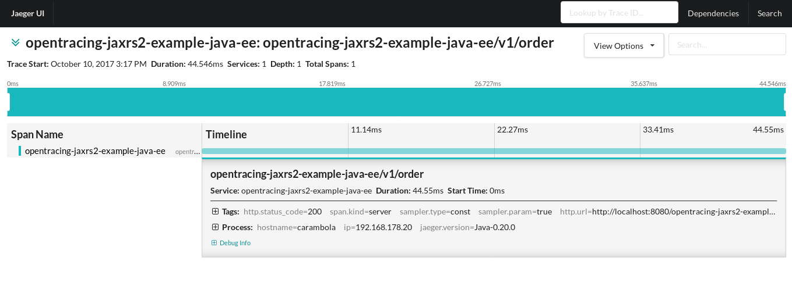

# OpenTracing JAX-RS - Java EE Example

## The example

This example shows how to use the OpenTracing JAX-RS integration in a Java EE applicationtions.

The example should generate a trace with a single span, like in the image below.



## Running

In order to visualize the spans, you'll need an instance of Jaeger running locally.
Any other OpenTracing tracer is supported: all it requires is to change the `pom.xml`
to remove Jaeger's dependencies and add your `TracerResolver` compatible Tracer.

Jaeger can be run via Docker as follows:
```
docker run \
    --rm \
    -p5775:5775/udp \
    -p6831:6831/udp \
    -p6832:6832/udp \
    -p5778:5778 \
    -p16686:16686 \
    -p14268:14268 \
    --name=jaeger \
    jaegertracing/all-in-one:latest
```

Make sure to at least export the environment variable `JAEGER_SERVICE_NAME`,
otherwise Jaeger will complain. A good set for development and testing purposes
is the following:

```
export JAEGER_SERVICE_NAME=opentracing-jaxrs2-example-java-ee
export JAEGER_REPORTER_LOG_SPANS=true
export JAEGER_SAMPLER_TYPE=const
export JAEGER_SAMPLER_PARAM=1
```

Once that is done, the example can be run as:
```
mvn wildfly:run
```

After Wildfly starts, traces can be created by making calls like this:
```
curl -v -X POST localhost:8080/opentracing-jaxrs2-example-java-ee/v1/order
```

If everything works as expected, the following can be seen on the logs:
```
15:17:32,744 INFO  [io.opentracing.contrib.jaxrs.example.javaee.Endpoint] (default task-1) Request received to place an order
15:17:32,757 INFO  [com.uber.jaeger.reporters.LoggingReporter] (default task-1) Span reported: 9d28b2cfa7b6e23:9d28b2cfa7b6e23:0:1 - opentracing-jaxrs2-example-java-ee/v1/order
```

Alternatively, the WAR file from this example can be deployed on WebSphere Liberty.
Assuming that it's installed at `${LIBERTY_HOME}`, the following commands can be used:

```
export JAEGER_SERVICE_NAME=opentracing-jaxrs2-example-java-ee-liberty
export JAEGER_REPORTER_LOG_SPANS=true
export JAEGER_SAMPLER_TYPE=const
export JAEGER_SAMPLER_PARAM=1
cp ./target/opentracing-jaxrs2-example-java-ee.war ${LIBERTY_HOME}/usr/servers/defaultServer/dropins/
${LIBERTY_HOME}/bin/server start
```

The server log should look like this:

```
********************************************************************************
product = WebSphere Application Server 17.0.0.2 (wlp-1.0.17.cl170220170523-1818)
wlp.install.dir = /mnt/storage/jpkroehling/Downloads/tmp/wlp/
server.config.dir = /home/jpkroehling/Downloads/tmp/wlp/usr/servers/defaultServer/
java.home = /usr/lib/jvm/java-1.8.0-openjdk-1.8.0.144-5.b01.fc26.x86_64/jre
java.version = 1.8.0_144
java.runtime = OpenJDK Runtime Environment (1.8.0_144-b01)
os = Linux (4.13.4-200.fc26.x86_64; amd64) (en_US)
process = 11563@carambola
********************************************************************************
[10/10/17 15:26:53:173 CEST] 00000001 com.ibm.ws.kernel.launch.internal.FrameworkManager           A CWWKE0001I: The server defaultServer has been launched.
...
...
[10/10/17 15:26:56:412 CEST] 0000002b com.ibm.ws.app.manager.AppMessageHelper                      I CWWKZ0018I: Starting application opentracing-jaxrs2-example-java-ee.
...
[10/10/17 15:26:59:165 CEST] 0000002b com.ibm.ws.ejbcontainer.osgi.internal.EJBRuntimeImpl         I CNTR4000I: The opentracing-jaxrs2-example-java-ee.war EJB module in the opentracing-jaxrs2-example-java-ee application is starting.
...
[10/10/17 15:26:59:494 CEST] 0000002b o.opentracing.contrib.jaxrs.example.javaee.TracerInitializer I Registering com.uber.jaeger.Tracer as the OpenTracing Tracer
...
[10/10/17 15:26:59:524 CEST] 0000002b com.ibm.ws.app.manager.AppMessageHelper                      A CWWKZ0001I: Application opentracing-jaxrs2-example-java-ee started in 3.113 seconds.
[10/10/17 15:26:59:536 CEST] 00000019 com.ibm.ws.kernel.feature.internal.FeatureManager            A CWWKF0012I: The server installed the following features: [jsp-2.3, ejbLite-3.2, managedBeans-1.0, jsf-2.2, beanValidation-1.1, servlet-3.1, ssl-1.0, jndi-1.0, jsonp-1.0, appSecurity-2.0, jdbc-4.1, jaxrs-2.0, jaxrsClient-2.0, el-3.0, json-1.0, jpaContainer-2.1, cdi-1.2, distributedMap-1.0, webProfile-7.0, websocket-1.1, jpa-2.1].
...
[10/10/17 15:26:59:537 CEST] 00000019 com.ibm.ws.kernel.feature.internal.FeatureManager            A CWWKF0011I: The server defaultServer is ready to run a smarter planet.
...
[10/10/17 15:27:59:835 CEST] 00000021 com.ibm.ws.webcontainer.servlet                              I SRVE0242I: [opentracing-jaxrs2-example-java-ee] [/opentracing-jaxrs2-example-java-ee] [io.opentracing.contrib.jaxrs.example.javaee.JaxRsExampleApplication]: Initialization successful.

```

At this point, just call the endpoint (make sure you are using the right port!):
```
curl -v -X POST localhost:9080/opentracing-jaxrs2-example-java-ee/v1/order
```

Wait a second or two and check your new span at the Jaeger's UI.